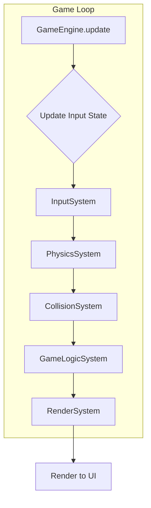

# Game Design Document: Love Letter and Robots Platformer

## 1. Introduction

### Game Title
Love Letter and Robots Platformer (Module Demo)

### Brief Description
This document outlines the design and architecture of a 2D platformer game built using Next.js and an Entity-Component-System (ECS) architecture. The game features a player character that can move horizontally, jump, and interact with a tile-based environment. It includes basic physics, collision detection, and animation states.

### Purpose of Document
This document serves as a comprehensive overview of the game's technical design, core mechanics, and architectural patterns. It aims to provide clarity on how different parts of the game interact and function.

## 2. Core Concepts

### Game Loop
The game operates on a continuous loop, driven by `requestAnimationFrame` in the `PlatformerGame` React component. Within each frame, the `GameEngine`'s `update` method is called, which in turn executes various systems to process game logic, physics, and rendering.

### Entity-Component-System (ECS) Architecture
The game is built upon an ECS architecture, promoting modularity, flexibility, and scalability.
*   **Entities:** Unique IDs representing game objects (e.g., Player, Platform). They are essentially containers for components.
*   **Components:** Raw data containers that define an entity's properties (e.g., position, velocity, sprite). Components have no logic.
*   **Systems:** Functions that operate on entities that possess specific combinations of components. Systems contain the game's logic and transform component data.

## 3. Components

Components are plain JavaScript objects holding data.

*   [`PositionComponent`](lib/game/components.js): Stores `x` and `y` coordinates.
*   [`VelocityComponent`](lib/game/components.js): Stores `x` and `y` velocities.
*   [`PhysicsComponent`](lib/game/components.js): Boolean indicating if physics (gravity) should apply.
*   [`RenderComponent`](lib/game/components.js): Stores sprite path, direction, animation state, width, and height for rendering.
*   [`PlayerComponent`](lib/game/components.js): Stores player-specific data like `moveSpeed`, `jumpStrength`, `isGrounded`, `isJumping`, `jumps`, `isAttacking`, `isClimbing`, `isPushing`, `isThrowing`, `isHurt`.
*   [`InputComponent`](lib/game/components.js): Stores the current `keysPressed` state for an entity.
*   [`CollisionComponent`](lib/game/components.js): Stores collision properties like `isSolid`, `width`, `height`, and `type`.
*   [`LevelComponent`](lib/game/components.js): Stores the raw `levelData` and `tileSize` for the current level.

## 4. Systems

Systems are functions that iterate over entities with relevant components and apply game logic.

*   [`InputSystem`](lib/game/systems/InputSystem.js): Processes user input (`keysPressed`) and updates the `VelocityComponent` and `RenderComponent` (for direction/animation) of player entities.
*   [`PhysicsSystem`](lib/game/systems/PhysicsSystem.js): Applies gravity to the `VelocityComponent` of entities with `PhysicsComponent`, but only if the entity (player) is not `isGrounded`.
*   [`CollisionSystem`](lib/game/systems/CollisionSystem.js):
    *   Handles movement and collision detection for entities with `CollisionComponent`.
    *   Uses a grid-based approach to check for collisions against solid, one-way, and damaging tiles in the `levelGrid`.
    *   Resolves collisions by adjusting `PositionComponent` and zeroing out `VelocityComponent` in the direction of collision.
    *   Updates the `isGrounded` state of the `PlayerComponent`.
    *   Employs a swept AABB method for robust collision detection on both horizontal and vertical axes.
*   [`GameLogicSystem`](lib/game/systems/GameLogicSystem.js): Manages general game logic, such as resetting `isHurt` state after a duration and ensuring animation states are consistent with player actions.
*   [`RenderSystem`](lib/game/systems/RenderSystem.js): Prepares data for rendering entities with `RenderComponent`. It transforms entity data into a format suitable for the React rendering layer.

### System Interaction Flow (within `GameEngine.update`)



## 5. Game World & Level Structure

The game world is tile-based, defined by a `levelGrid`.

*   **Tile Size:** Defined by `TILE_SIZE` (currently 32 pixels).
*   **Level Data Format:** Levels are represented as a 2D array (grid) of characters, where each character denotes a tile type (e.g., 'G' for ground, 'O' for one-way platform, 'L' for damaging lava, 'St' for start position).
*   **Platform Types:**
    *   **Solid ('G', 'R', 'W'):** Impassable from all directions.
    *   **One-Way ('O'):** Can be jumped through from below, but solid from above.
    *   **Damaging ('L'):** Inflicts damage upon contact.

## 6. Player Mechanics

*   **Movement:**
    *   Horizontal movement is controlled by 'ArrowLeft' and 'ArrowRight' keys, updating `VelocityComponent.x`.
    *   Jumping is controlled by the 'Space' key, applying an upward `VelocityComponent.y` if grounded or performing a double jump.
*   **Collision Handling:**
    *   Uses a grid-based swept AABB approach for precise collision detection with solid and one-way tiles.
    *   Resolves collisions by snapping the player to the edge of the colliding tile and zeroing out velocity in the collision direction.
    *   `isGrounded` state is managed by `CollisionSystem` to control gravity application.
*   **Animations:**
    *   `RenderComponent.animationState` is updated by `InputSystem` and `GameLogicSystem` based on player actions (idle, run, jump, attack, hurt, climb, push, throw).

## 7. Technical Details

*   **Next.js Integration:** The game engine is integrated into a Next.js application. The `PlatformerGame` component manages the game loop and renders the game state.
*   **State Management:** Game state is primarily managed within the `GameEngine` class and its entities/components. React components consume the rendered output from the `RenderSystem`.
*   **Asset Handling:** Sprites and level data are loaded from the `public` directory.
*   **Event Bus:** An `EventBus` is available for decoupled communication between different parts of the game, though currently, direct system calls are used for simplicity.

## 8. ECS Architecture Diagram

```mermaid
graph TD
    A[GameEngine] --> B(Entities);
    B --> C(Components);
    C --> D[Systems];

    subgraph Components
        C1(PositionComponent)
        C2(VelocityComponent)
        C3(PhysicsComponent)
        C4(RenderComponent)
        C5(PlayerComponent)
        C6(InputComponent)
        C7(CollisionComponent)
        C8(LevelComponent)
    end

    subgraph Systems
        S1[InputSystem]
        S2[PhysicsSystem]
        S3[CollisionSystem]
        S4[GameLogicSystem]
        S5[RenderSystem]
    end

    D --> S1;
    D --> S2;
    D --> S3;
    D --> S4;
    D --> S5;

    S1 --> C2 & C4;
    S2 --> C2;
    S3 --> C1 & C2 & C5;
    S4 --> C4 & C5;
    S5 --> C4;

    S1 --> B;
    S2 --> B;
    S3 --> B;
    S4 --> B;
    S5 --> B;

    A --> S1 & S2 & S3 & S4 & S5;
    A --> B;